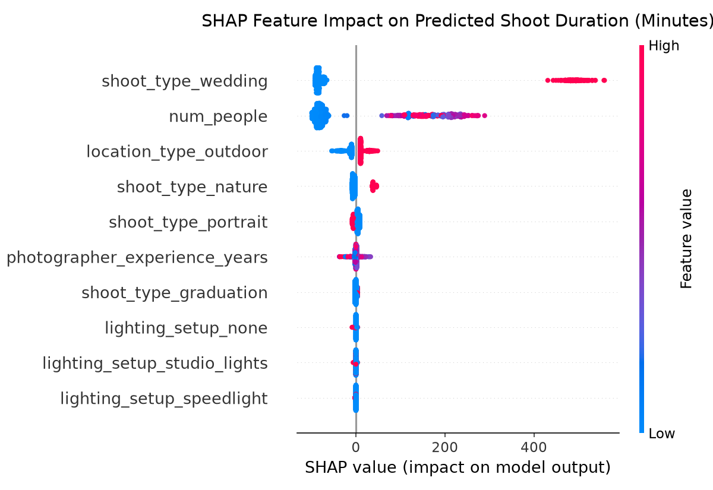

# ShutterIQ 📸🤖

An intelligent scheduling assistant and business optimization suite for photographers. ShutterIQ uses machine learning to predict shoot durations, recommend dynamic pricing based on client willingness-to-pay (WTP), and optimize outdoor shoot windows using local weather and solar golden hour alignment.

This repository is designed as a data science portfolio project demonstrating the integration of predictive models, pricing optimization, and smart scheduling heuristics.

---

## Project Architecture & Core Components

ShutterIQ is structured around three primary data-driven engines:

### 1. Predictive Shoot Duration Engine
* **Objective:** Predict actual shoot duration (regression) to optimize photographer timetables and prevent overlapping bookings.
* **Approach:** Uses factors like shoot type (portrait, wedding, event, graduation, nature), client group size (non-linear logarithmic scaling), location type (indoor vs. outdoor), and weather conditions to forecast required calendar slots, incorporating historical variance.

### 2. Dynamic Pricing Engine
* **Objective:** Recommend optimized, yield-maximizing prices for photography booking requests.
* **Approach:** Estimates price elasticity of demand by comparing quoted price against the client's latent willingness-to-pay (WTP) threshold. Combines compounding multipliers for seasonality (peaks in Sri Lankan wedding and graduation months), day-of-week demand spikes, lead time constraints (last-minute booking markup), and photographer experience.

### 3. Golden Hour & Weather Optimizer
* **Objective:** Recommend scheduling windows for outdoor shoots to maximize lighting quality.
* **Approach:** Integrates weather forecasts and solar elevation calculations (golden hour peaks) to determine the best hours of the day for outdoor portraiture, graduation, and nature shoots.

---

## Project Structure

```text
├── data/         # Generated synthetic booking datasets (ignored in git)
├── simulate/     # Data simulation engine
│     ├── __init__.py
│     └── generate_bookings.py  # Synthetic booking generator with economic modeling
├── models/       # ML models (predictors and elasticity estimators)
├── api/          # FastAPI backend services
├── app/          # Streamlit user interface
├── reports/      # SHAP explainability summaries and plots
├── tests/        # Pytest unit tests
│     ├── __init__.py
│     ├── test_duration_model.py
│     └── test_generate_bookings.py
├── .gitignore
├── requirements.txt
└── CHANGELOG.md
```

---

## Stage 0 Scope: Scaffolding & Synthetic Data Foundation
In Stage 0, we establish the project structure, development environment, and the synthetic data generator. The generator simulates realistic booking transactions under the following economic and physical assumptions:
* ** Sri Lankan Seasonality:**
  * **Wedding Season Peak:** May, June, November, and December (applying a $+35\%$ multiplier to pricing and willingness-to-pay).
  * **Graduation Season Peak:** July and August (applying a $+25\%$ multiplier to graduation shoots).
* **Non-linear Durations:** Duration scales logarithmically with group size ($\alpha \log(N)$) and adds $+15\%$ setup overhead for outdoor shoots, with multiplicative log-normal noise.
* **Price Elasticity:** Customer acceptance of quotes is modeled using a logistic curve representing price-to-willingness-to-pay ratios ($P(\text{Accept}) = \frac{1}{1 + e^{k(\text{price}/\text{wtp} - 1)}}$). This ensures that higher quotes relative to a customer's budget result in fewer accepted bookings, creating a realistic demand curve.

---

## Stage 1: Predictive Shoot Duration Model
In Stage 1, we implemented the **Predictive Shoot Duration Engine** using machine learning to predict actual shoot durations from booking parameters.

### 1. Modeling & Validation Results
We split our 1,000 synthetic records into an 80/20 train/test split and evaluated both a baseline Linear Regression model and a challenger XGBoost Regressor:

| Model | Train MAE | Train RMSE | Test MAE | Test RMSE |
| :--- | :--- | :--- | :--- | :--- |
| **Linear Regression (Baseline)** | 23.12 mins | 35.63 mins | 20.31 mins | 29.94 mins |
| **XGBoost Regressor (Challenger)** | 11.83 mins | 19.52 mins | 16.16 mins | 31.31 mins |

*Observations:* XGBoost improves mean absolute error (MAE) significantly from 20.31 minutes to 16.16 minutes on the test set, capturing non-linear relationships (logarithmic group size scaling and interaction terms) that Linear Regression struggles to approximate.

### 2. Recommended Scheduling Buffer Time
Rather than utilizing an arbitrary flat buffer (e.g. "always add 30 mins"), we estimate a heteroscedastic scheduling buffer based on the prediction uncertainty (standard deviation of residuals, $e = y - \hat{y}$) for each shoot type. Using a $1.645\times\sigma_{e, \text{type}}$ multiplier ensures a **95% protection threshold** against scheduling overruns:
* **Wedding:** 140 minutes buffer (reflects high schedule volatility and guest counts)
* **Event:** 50 minutes buffer
* **Nature:** 25 minutes buffer
* **Graduation:** 15 minutes buffer
* **Portrait:** 10 minutes buffer

### 3. Model Interpretability (SHAP Analysis)
We computed SHAP values on the XGBoost model to inspect feature impacts:


*Key Insights:*
* **Guest Count (`num_people`):** Highly positive impact. Larger groups represent the single largest driver of extended shoot durations.
* **Shoot Type:** Wedding and event shoot types have strong positive base effects on duration, while portrait and graduation have negative effects relative to the reference category.
* **Location Type (`location_type_outdoor`):** Outdoor shoots shift predictions upward due to ambient lighting adjustments and setup overhead.

---

## Stage 2: Dynamic Pricing Model
In Stage 2, we implement a **Dynamic Pricing Engine** that recommends optimized, yield-maximizing prices for photography services.

### 1. Elasticity Framing vs. Baseline Regression
We contrast two distinct approaches to price recommendation:
* **Baseline Regressor (Direct Price Prediction):** A model trained to predict historical quoted prices ($p$) directly from booking features. It represents "what we historically charged." It does not capture whether clients accepted those quotes or how sensitive they were to price.
* **Elasticity Model (Expected Revenue Optimization):** A classifier that predicts booking acceptance probability, $P(\text{Accept} \mid p, \mathbf{x})$, as a function of the candidate price $p$ and booking conditions $\mathbf{x}$. We then search a grid of candidate prices to recommend the price $p^*$ that maximizes expected revenue:
$$\text{Expected Revenue}(p) = p \times P(\text{Accept} \mid p, \mathbf{x})$$

### 2. Overcoming Causal Confounding & Multicollinearity
A naive regression of booking acceptance on price and all features fails because the quoted price is highly collinear with the features that determine it (e.g., weddings are always expensive and have high baseline acceptance). If all features are included, the price coefficient becomes positive (selection bias).
To resolve this, we leverage **econometric instrumental variable principles**:
* **Exogenous Price Shifters:** We exclude `day_of_week` and `lead_time_days` from the elasticity classifier. In our synthetic engine, these features act as price shifters (increasing prices on weekends and last-minute requests) but do not affect the client's latent willingness-to-pay (WTP).
* By excluding them, the model utilizes the exogenous price variations induced by weekends and lead times to isolate and fit a stable, negative price elasticity coefficient.

### 3. Log-Price Baseline Transformation
Because the true pricing generator is compounding/multiplicative (`price = base * season_mult * day_mult * ...`), a linear regression on raw prices produces negative price predictions for cheaper services (like portraits) under discount conditions.
* We train the baseline model on the natural logarithm of price, $\log(p)$, and exponentiate the predictions: $p_{\text{baseline}} = e^{\hat{\log(p)}}$.
* This guarantees positive recommended prices and dramatically improves baseline model performance:
  * **Raw Price Baseline R²:** $0.9387$ | **Test MAE:** \$167.51
  * **Log-Price Baseline R²:** **$0.9925$** | **Test MAE:** **\$52.44**

### 4. Category-Specific Price Elasticity (Interaction Terms)
Photography services vary in scale by an order of magnitude (\$150 portraits vs. \$2,000 weddings). A flat global price coefficient will fail to capture this scale difference. We introduce interaction features between `quoted_price` and `shoot_type` (`price_x_<shoot_type>`), which enables the Logistic Regression classifier to learn a distinct elasticity curve for each service category.

### 5. Latent Willingness-to-Pay (WTP) Recovery
In our synthetic generator, a booking is accepted based on the client's budget (willingness-to-pay). At the threshold where $P(\text{Accept}) = 0.5$, the quote price equals the client's WTP. We evaluate our elasticity classifier by solving for the price that yields exactly $P(\text{Accept}) = 0.5$ (implied WTP) and comparing it against the latent `true_wtp` column in the test set.

Our model recovers the latent willingness-to-pay pattern with outstanding accuracy:
* **Overall WTP Recovery MAE:** **\$109.43**
* **Overall WTP Recovery R²:** **$0.9838$**
* **Overall WTP Correlation:** **$0.9920$**

#### Detailed WTP Recovery by Shoot Type:
* **portrait**: MAE = \$29.36 | R² = $0.6830$ | Correlation = $0.8285$
* **graduation**: MAE = \$44.57 | R² = $0.6723$ | Correlation = $0.8248$
* **nature**: MAE = \$55.40 | R² = $0.5542$ | Correlation = $0.8713$
* **event**: MAE = \$150.52 | R² = $0.6328$ | Correlation = $0.8012$
* **wedding**: MAE = \$454.04 | R² = $0.8432$ | Correlation = $0.9208$

### 6. Standard Model Performance Metrics
* **Baseline Regressor Test MAE:** \$52.44 | **R²:** $0.9925$
* **Elasticity Classifier Test Accuracy:** $0.7100$ | **ROC AUC:** $0.7677$

---

## Stage 3: Golden Hour & Weather Optimization
In Stage 3, we implement the **Golden Hour & Weather Optimizer** for scheduling outdoor photography sessions.

### 1. Objective and Architecture
Outdoor shoots depend heavily on lighting and weather. This engine calculates daylight hours slots (7:00 AM to 6:00 PM) for a candidate date range and location, ranking them to find the optimal slots. It combines:
* **Astronomical Calculations (via `astral`):** Timezone-aware morning/evening golden hour and blue hour boundaries.
* **Meteorological Forecasts (via Open-Meteo API):** Live, hourly forecasts for cloud cover, precipitation probability, and temperature.

### 2. Composite Scoring Algorithm (Option A)
Each hourly slot's midpoint is scored on a $[0, 1]$ scale using the following components:
* **Solar Lighting Score ($S_{\text{light}}$):**
  * Midpoint falls inside a golden hour window = $1.0$.
  * Midpoint falls inside a blue hour window = $0.8$.
  * Outside windows, score decays exponentially: $S_{\text{light}} = \max(1.0 \times e^{-d_{\text{gold}}/120}, 0.8 \times e^{-d_{\text{blue}}/120})$, where $d$ is distance in minutes.
* **Cloud Cover Score ($S_{\text{cloud}}$):**
  * Peak score ($1.0$) is achieved at $30\%$ cloud cover (ideal diffused natural lighting).
  * Direct harsh sunlight ($0\%$ cloud cover) drops the score to $0.6$.
  * Overcast gloom ($100\%$ cloud cover) drops the score to $0.4$.
* **Precipitation Veto Score ($S_{\text{precip}}$):**
  * Calculated as $S_{\text{precip}} = 1.0 - (\text{precipitation\_probability} / 100)$.
  * This acts as a **multiplicative veto**: a $100\%$ chance of rain yields $S_{\text{precip}} = 0.0$, driving the overall slot score to $0.0$.

The composite slot score is:
$$\text{Score} = (0.6 \times S_{\text{light}} + 0.4 \times S_{\text{cloud}}) \times S_{\text{precip}}$$

### 3. Graceful Degradation & Fallbacks
If the Open-Meteo API is unreachable, times out, or returns HTTP errors:
* The engine logs a warning to stderr.
* The algorithm degrades to **golden-hour-only scoring** by setting $S_{\text{cloud}} = 1.0$, $S_{\text{precip}} = 1.0$, and reporting weather metrics as `NaN`.
* The final slot score simplifies to:
$$\text{Score} = S_{\text{light}}$$
* This guarantees that scheduling recommendations are still generated based on astronomical solar positions.

### 4. Direct Invocation CLI
You can run the optimizer from the command line:
```bash
python models/weather_optimizer.py --lat 6.9271 --lon 79.8612 --days 3
```

---

## Stage 4: API Integration Layer
In Stage 4, we expose the predictive models, pricing logic, and scheduling heurists behind a RESTful **FastAPI Integration Layer**.

### 1. Model Preloading Strategy (FastAPI Lifespan)
To prevent runtime disk I/O latency, the API implements a startup loading handler.
* **Startup Lifespan Event:** At server startup, the app calls the caching loaders (`_get_artifacts()`) in the duration and pricing modules.
* This pre-deserializes the XGBoost and Logistic Regression pipelines from `duration_model.pkl` and `pricing_model.pkl` and caches them in memory.
* All subsequent requests run predictions instantaneously without disk access or retraining.

### 2. Exposed REST Endpoints
* **`GET /health`**
  * Health check endpoint. Returns `{"status": "OK"}`.
* **`POST /predict-duration`**
  * Accepts booking features and returns predicted duration plus the 95% protection scheduling buffer.
* **`POST /recommend-price`**
  * Recommends a quote price designed to maximize expected dynamic revenue.
* **`POST /best-slots`**
  * Returns a ranked list of daytime hours slots scored by solar lighting and meteorological constraints.
* **`POST /schedule-suggestion` (Combined Endpoint)**
  * Unified scheduler: accepts booking request details and returns duration prediction, price recommendations, and optimal outdoor slots.
  * **Indoor Optimization:** If `location_type` is `"indoor"`, weather forecast fetches are skipped entirely, and `best_slots` returns `[]`.

### 3. Local API Execution
Start the local server using Uvicorn:
```bash
uvicorn api.main:app --reload --host 127.0.0.1 --port 8000
```
FastAPI auto-generates interactive Swagger UI documentation at: [http://127.0.0.1:8000/docs](http://127.0.0.1:8000/docs).

### 4. Combined Request/Response Example
#### Request:
`POST /schedule-suggestion`
```json
{
  "shoot_type": "portrait",
  "num_people": 2,
  "location_type": "outdoor",
  "lighting_setup": "natural_light",
  "photographer_experience_years": 5,
  "season": "regular_season",
  "day_of_week": "Saturday",
  "lead_time_days": 10,
  "latitude": 6.9271,
  "longitude": 79.8612,
  "start_date": "2026-07-26",
  "end_date": "2026-07-26",
  "timezone": "Asia/Colombo"
}
```

#### Response:
```json
{
  "duration_prediction": {
    "predicted_duration_minutes": 52.48,
    "recommended_buffer_minutes": 10
  },
  "price_recommendation": {
    "recommended_price": 205.0,
    "expected_revenue": 142.12
  },
  "best_slots": [
    {
      "start_time": "2026-07-26T17:00:00+05:30",
      "end_time": "2026-07-26T18:00:00+05:30",
      "score": 0.4702,
      "lighting_score": 0.767,
      "cloud_score": 0.777,
      "precip_score": 0.61,
      "cloud_cover_percent": 30.0,
      "precip_prob_percent": 39.0,
      "temperature_c": 28.8,
      "weather_available": true
    }
  ]
}
```

---

## Installation & Setup

Ensure you have Python 3.11+ installed.

### 1. Set Up the Virtual Environment
Create and activate a local Python virtual environment:
```bash
# Create venv
python -m venv .venv

# Activate venv (macOS/Linux)
source .venv/bin/activate

# Activate venv (Windows)
.venv\Scripts\activate
```

### 2. Install Dependencies
Install all package requirements pinned to ensure reproducibility:
```bash
pip install -r requirements.txt
```

### 3. Generate the Synthetic Dataset
Run the data generator to create a baseline set of 1,000 bookings:
```bash
python -m simulate.generate_bookings --num-records 1000 --output data/bookings.csv
```

### 4. Run the Test Suite
Validate the synthetic data generation engine and sanity checks:
```bash
pytest
```
